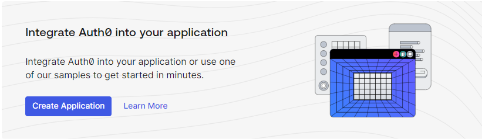
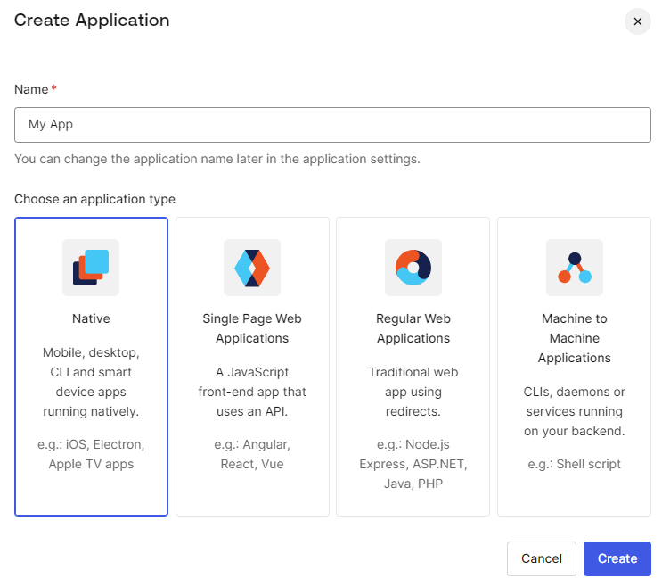
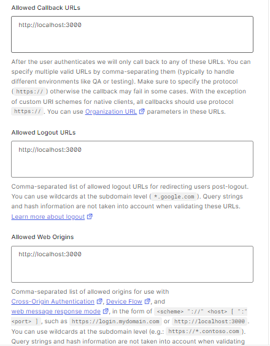

## Auth0 & React Serverless Integration

#### Repo usage:

Clone the repo and install all dependecies

#### Setting up Auth0 environment:

- In tenant (that groups your applications), create a new application.

  

- Choose type of your application - Single Page Website is the one that we want to choose when integrating with serverless React

  

- Go to your application settings and paste your react development server URL for Allowed Callbacks URL, Allowed Logout URLs and Allowed Web Origins (http://localhost:3000 by default). You can change it up to your needs.

  

- Go to connections tab within your application and set up desired connection

  > If you want to set up a new social connection, go to Authentication --> Social --> Create Connection.
  > Remember to add desired permissions for accessing certain provider user data.

- Fill up .env with your application domain and client id that you can find in application settings dashboard.

#### Accesing information and customizing:

- You can control your apps users in `User management --> Users`

- You can customize Login widget in `Branding --> Universal Login--> Customization Options`

- You can create your own Login logic with `Actions`

> !! Remember to add .env file to .gitignore before commiting and pushing code to github !!!
